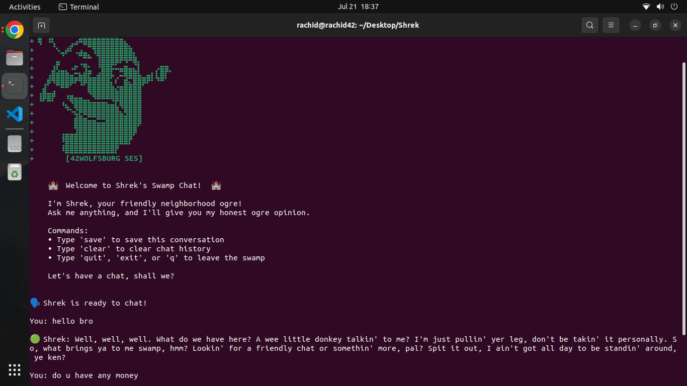
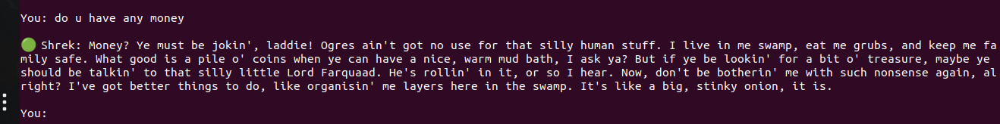

# 🏰 Shrek AI Chat Bot

An improved AI-powered chat bot that brings Shrek to life using Mistral AI's advanced language models!

## 🚀 Features

- **Mistral AI Integration**: Uses state-of-the-art Mistral AI models for natural conversations
- **Shrek Personality**: Authentic Shrek character with Scottish accent and ogre charm
- **Conversation Memory**: Remembers context from previous messages
- **Save & Load**: Save conversations to JSON files
- **Error Handling**: Robust error handling for network issues and API errors
- **Security**: API keys stored securely in environment variables
- **User-Friendly**: Interactive commands and helpful prompts

<!-- Local image (relative path) -->




## 🛠️ Installation

1. **Clone the repository**:
   ```bash
   git clone https://github.com/RachMatriss/Shrek.git
   cd Shrek
   ```

2. **Install dependencies**:
   ```bash
   pip install -r requirements.txt
   ```

3. **Set up Mistral AI API**:
   - Get your API key from [Mistral AI Console](https://console.mistral.ai/)
   - Create a `.env` file (copy from `.env.example`):
   ```bash
   cp .env.example .env
   ```
   - Edit `.env` and add your API key:
   ```
   MISTRAL_API_KEY=your_actual_api_key_here
   ```

## 🎯 Usage

### Basic Usage
```bash
python chat.py
```

### Commands
- **Chat normally**: Just type your message
- **Save conversation**: Type `save`
- **Clear history**: Type `clear`
- **Exit**: Type `quit`, `exit`, `q`, or `bye`

### Example Conversation
```
🏰  Welcome to Shrek's Swamp Chat!  🏰

You: What do you think about onions?
Shrek: Oi, onions? *laughs* Perfect question for an ogre! Onions are like life, lad - they've got layers! Just like me, just like you, just like everybody else. You peel back one layer and there's another underneath. *chuckles* Plus, they make a right good stew when you're cooking for a hungry family of four... or a hungry ogre of one!
```

## 🔧 Configuration

### Environment Variables
- `MISTRAL_API_KEY`: Your Mistral AI API key (required)
- `MISTRAL_MODEL`: Model to use (optional, defaults to `mistral-large-latest`)

### Available Models
- `mistral-large-latest` (default) - Most capable model
- `mistral-medium-latest` - Balanced performance
- `mistral-small-latest` - Fastest responses

## 📁 File Structure
```
Shrek/
├── chat.py              # Main chat bot application
├── requirements.txt     # Python dependencies
├── .env.example        # Environment variables template
├── README.md           # This file
├── shrek.png          # Shrek image
└── shrek.sh           # Shell script (legacy)
```

## 🔒 Security Notes

- Never commit your `.env` file with API keys
- API keys are loaded from environment variables only
- No sensitive data is logged or stored permanently

## 🐛 Troubleshooting

### Common Issues

**"MISTRAL_API_KEY environment variable not found"**
- Make sure you've created a `.env` file
- Ensure the variable is properly set: `export MISTRAL_API_KEY='your-key'`

**"Network error" or timeout issues**
- Check your internet connection
- Verify Mistral AI service status
- Try reducing `max_tokens` in the code

**Import errors**
- Run `pip install -r requirements.txt` to install dependencies

## 📝 API Reference

The bot uses Mistral AI's Chat Completions API:
- **Endpoint**: `https://api.mistral.ai/v1/chat/completions`
- **Documentation**: [Mistral AI Docs](https://docs.mistral.ai/)

## 🤝 Contributing

1. Fork the repository
2. Create a feature branch
3. Make your improvements
4. Test thoroughly
5. Submit a pull request

## 📄 License

This project is open source and available under the MIT License.

## 🙏 Acknowledgments

- **Mistral AI** for providing the powerful language models
- **DreamWorks** for creating the beloved Shrek character
- **Open source community** for continuous inspiration

---

*"What are you doing in my swamp?!"* - Shrek
