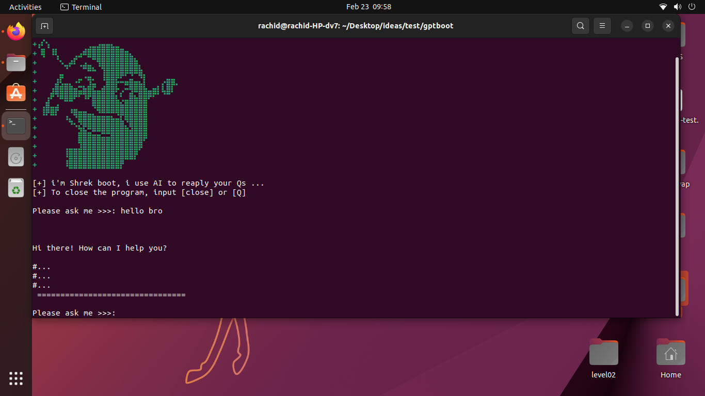

# Shrek Boot

> 🐸 **Shrek Boot** is a terminal-based AI assistant powered by OpenAI’s GPT-3.
> It greets you with a friendly ASCII-art Shrek, listens for your questions, and replies right in your shell.



## 🚀 Features

* **GPT-3 Integration**
  Uses OpenAI’s GPT-3 API to generate answers to your terminal queries.
* **Terminal UI**
  A lightweight Python script you run directly in your console.
* **ASCII-art Shrek**
  A fun Shrek illustration to welcome you every time you launch the assistant.
* **Easy Exit**
  Type `close` or `Q` to quit at any time.

## 📋 Prerequisites

* Python 3.7 or higher
* An [OpenAI API key](https://platform.openai.com/)

## 🔧 Installation

1. **Clone the repo**

   ```bash
   git clone https://github.com/RachMatriss/Shrek.git
   cd shrek-boot
   ```
2. **Install dependencies**

   ```bash
   pip install -r requirements.txt
   ```
3. **Configure your API key**

   ```bash
   export OPENAI_API_KEY="your_api_key_here"
   ```

## 🎬 Usage

1. **Launch Shrek Boot**

   ```bash
   sh shrek.sh
   ```
2. **Ask your questions**

   ```
   [+] I’m Shrek Boot, I use AI to reply your Qs …
   [+] To close the program, input [close] or [Q]

   Please ask me >>>: How does photosynthesis work?
   Hi there! How can I help you?
   ```
3. **Exit**

   ```
   Please ask me >>>: close
   Goodbye!
   ```

## ⚙️ Configuration

* **Model**: Edit the `MODEL` constant in `shrek_boot.py` to switch between engines (e.g. `text-davinci-003`, `gpt-3.5-turbo`).
* **Prompts**: Tweak the opening Shrek persona in `PROMPT` for a different greeting style.
* **Token Limits & Timeouts**: Adjust API parameters in the script as needed.

## 🤝 Contributing

1. Fork this repository
2. Create your feature branch

   ```bash
   git checkout -b feature/your-feature
   ```
3. Make your changes & commit

   ```bash
   git commit -m "Add your feature"
   ```
4. Push and open a PR

   ```bash
   git push origin feature/your-feature
   ```

## 📜 License

Distributed under the MIT License. See [`LICENSE`](LICENSE) for details.

## 🙏 Acknowledgments

* [OpenAI](https://openai.com/) for GPT-3
* DreamWorks Animation’s Shrek for the inspiration and ASCII art
* You, for giving Shrek Boot a spin!
